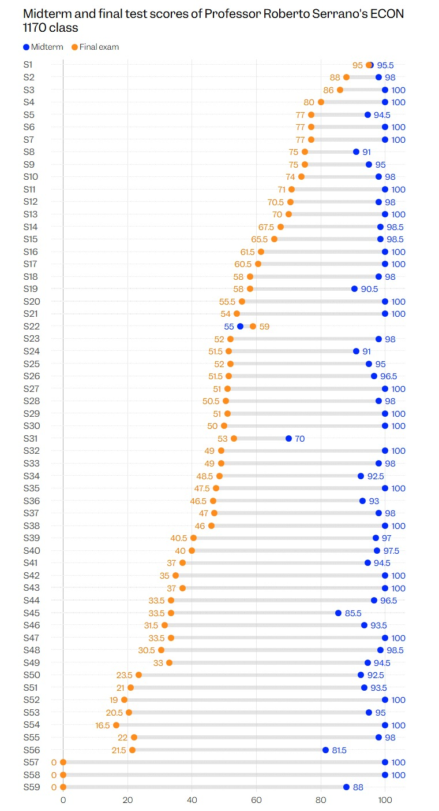

{width=100% fig-align="center" style="transform: rotate(360deg);"}

[This chart should be a 'wake-up call' about AI cheating, Brown University professor says](https://www.businessinsider.com/brown-university-ai-cheating-scandal-2026-7).

Or 

[Brown Professor Suspects Majority of His Class Used AI to Cheat](https://www.insidehighered.com/news/faculty/learning-assessment/2026/07/08/brown-professor-suspects-most-his-class-used-ai-cheat)

## We Cannot Choose to Become Idiots 

As colleges and universities grapple with AI, cheating must be taken seriously, Serrano said. “We cannot afford to have a society in which a significant fraction of our best young minds think that cheating is OK,” he said. “That leads to a declining society, to a failed society … **We cannot choose to become idiots.**”

