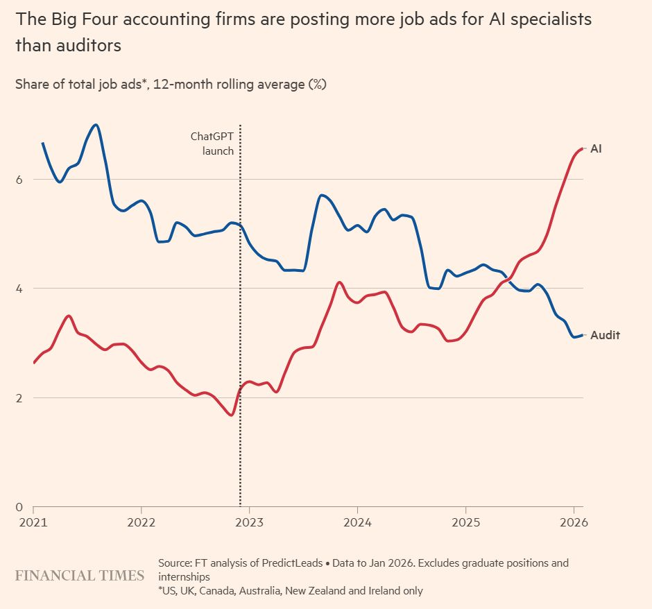

{width=100% fig-align="center" style="transform: rotate(360deg);"}

The Big Four accounting and consulting firms — Deloitte, EY, KPMG, and PwC — advertised more AI-related job postings than traditional auditing positions in 2025, according to a new analysis by the [Financial Times.](https://www.ft.com/content/46f3bb0e-7e6f-451a-af5e-b1c820ffaa71?syn-25a6b1a6=1).

Nearly 7% of the firms’ job postings required AI expertise, compared to less than 2% in 2022 when OpenAI’s ChatGPT was launched. At the same time, auditing roles accounted for just under 3% of the postings last year. One of the firms also noted that a single job posting could, in some cases, apply to multiple positions.

According to the Times, the hiring trend shows how quickly AI is transforming the consulting and auditing industries. At the same time, the industry is trying to adapt to the fact that AI could undercut the need for certain junior positions. Traditionally, consulting firms have been built on a “pyramid model” where many younger employees work under a smaller number of senior managers and partners. AI is now expected to automate parts of that workplace arrangement.

None of this means the *auditor’s job is finished*. Audits still need sign-off, professional scepticism and accountability that no model can provide, and regulators expect a person to stand behind the numbers. But the entry-level path into the profession is changing quickly, and the firms that set that path have just shown their hand.

